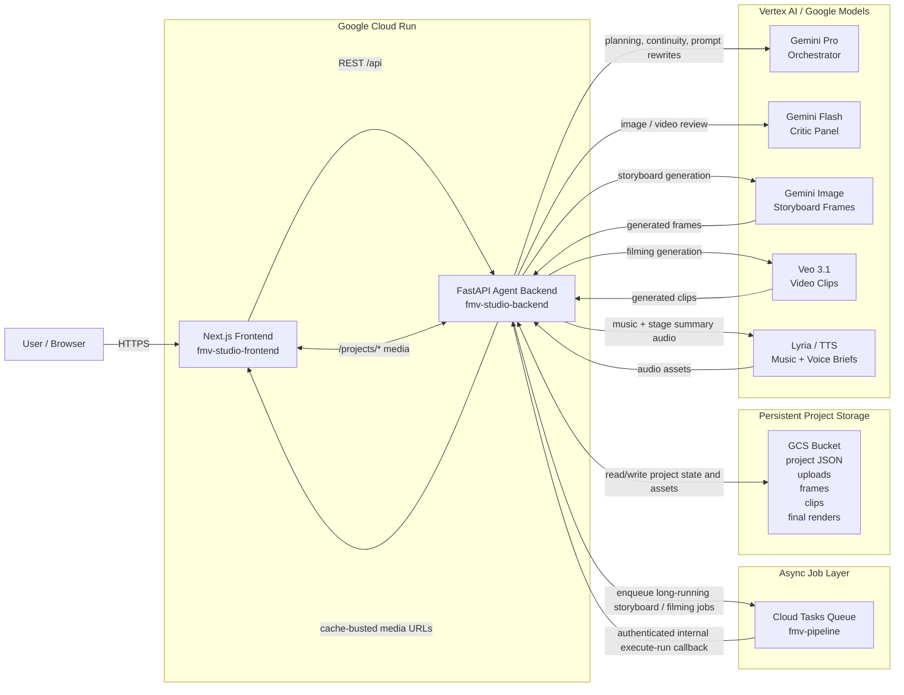

# FMV Studio Architecture Diagram

This diagram shows the deployed Google Cloud architecture that the Gemini Live Agent Challenge judges will evaluate.

## Runtime Flow

1. The user interacts with the Next.js frontend on Cloud Run.
2. The frontend sends project updates and pipeline commands to the FastAPI backend.
3. The backend persists project state and generated media into Google Cloud Storage.
4. Long-running storyboard and filming work is queued through Cloud Tasks.
5. The backend processes those jobs and calls Vertex AI models for orchestration, critique, image generation, video generation, and music / voice synthesis.
6. Generated assets are written back to GCS and served to the frontend through the backend's `/projects/...` URLs.

## Notes For Judges

- The same codebase also supports local mode, but the hackathon deployment path is Cloud Run + Vertex AI + GCS + Cloud Tasks.
- The frontend and backend are deployed separately.
- Async runs are durable because project state is persisted outside the Cloud Run instance.
- Model roles are split:
  - `Gemini Pro` for orchestration and prompt rewriting
  - `Gemini Flash` for critique
  - `Veo` for video
  - `Gemini Image` for storyboards
  - `Lyria / TTS` for music and spoken stage briefs
